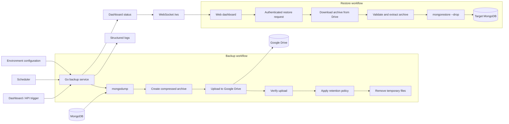

# MongoDB Google Drive Backup Service

Production-ready Go service that periodically backs up a MongoDB database and uploads it to Google Drive.

## Architecture



The scheduler and dashboard can trigger the same backup job. Backup progress, logs, and Drive
contents are pushed to connected dashboard clients over WebSocket; restore requests follow a
separate authenticated path and never persist MongoDB connection URLs.

## Requirements

- Docker
- MongoDB instance
- Google Drive destination folder
- Either:
  - Google Cloud service account with Drive API access **and** a Shared Drive, or
  - Personal Gmail account using OAuth 2.0

## Dashboard and realtime features

The built-in web dashboard is served when `WEB_PORT` is configured. It uses a WebSocket (`/ws`) stream for push-driven updates so the page receives `status`, `logs`, and `backups` payloads automatically. This avoids the need for browser fetch polling or manual refresh loops.

The dashboard displays live time/date and a countdown timer labeled **Next auto backup starts in: hh:mm:ss**, updated every second.

The OAuth authorize button is also now wired to the token status endpoint. If a valid refresh token is already available in `GOOGLE_OAUTH_TOKEN_FILE` or `GOOGLE_OAUTH_TOKEN_JSON`, the button is disabled automatically and the page reflects that the token is already authorized.

The dashboard includes a **Stop Service** control. Stopping the service cancels the active
backup/scheduler context and gracefully shuts down the web listener, releasing `WEB_PORT`.
`--once` mode also exits automatically after the single backup completes.

## Backup and restore instructions

### Create a backup

1. Confirm `MONGODB_URI`, `MONGODB_DATABASE`, Google Drive credentials, and the tool paths are configured.
2. Run `./run.sh --once` for a one-time backup, or run `./run.sh` to start the scheduler.
3. To use the dashboard, set `WEB_PORT=8080`, open `http://localhost:8080`, and click **Run Backup Now**.
4. Confirm the log shows `backup_completed` and note the uploaded filename in the dashboard.

Each backup is made with `mongodump --db=<MONGODB_DATABASE>`, compressed as a `.tar.gz` archive,
uploaded to the configured Google Drive folder, and removed from the temporary directory after upload.
The scheduled backup uses `BACKUP_SCHEDULE` and `BACKUP_TIMEZONE`.

### Restore a backup

Restore is destructive: matching collections in the target database are replaced with `--drop`.
Before continuing, verify the selected Drive file and make a backup of the current target database.

1. Open the authenticated dashboard and select a backup in **Restore a backup**.
2. Enter the target MongoDB URL. Use **Show** if you need to verify the URL, then hide it again.
3. Enter the exact source database name stored in the backup. This is normally the database used by
   `MONGODB_DATABASE` when the backup was created, not necessarily the target database currently configured.
4. Type `RESTORE` and confirm the browser warning.
5. Wait for `restore_download_completed`, then `mongodb_restore_completed` in the live logs.

The service downloads the archive into a private temporary directory, validates its paths, and supports
both normal `database/collection.bson` archives and flat BSON dumps. If the database name is wrong, the
download can succeed but restore will fail with “backup does not contain database”.

## Environment Variables

| Variable                         | Description                          | Default                |
| -------------------------------- | ------------------------------------ | ---------------------- |
| `APP_ENV`                        | Environment                          | `production`           |
| `MONGODB_URI`                    | MongoDB connection string            | Required               |
| `MONGODB_DATABASE`               | Database name to backup              | Required               |
| `BACKUP_SCHEDULE`                | Cron schedule                        | `0 2 * * *`            |
| `BACKUP_TIMEZONE`                | Schedule timezone                    | `UTC`                  |
| `GOOGLE_DRIVE_FOLDER_ID`         | Target Drive folder ID               | Required               |
| `GOOGLE_SHARED_DRIVE_ID`         | Shared Drive ID                      | Optional               |
| `GOOGLE_OAUTH_CREDENTIALS_FILE`  | OAuth client credentials JSON path   | Optional               |
| `GOOGLE_OAUTH_CREDENTIALS_JSON`  | OAuth client credentials JSON inline | Optional               |
| `GOOGLE_OAUTH_TOKEN_FILE`        | OAuth token file path                | `./token.json`         |
| `GOOGLE_OAUTH_TOKEN_JSON`        | OAuth token JSON inline              | Optional               |
| `GOOGLE_OAUTH_CALLBACK_URL_PRODUCTION` | Production OAuth callback URL | Optional |
| `GOOGLE_OAUTH_CALLBACK_URL_LOCAL`      | Local OAuth callback URL      | Optional |
| `GOOGLE_APPLICATION_CREDENTIALS` | Service account JSON file path       | Optional               |
| `GOOGLE_SERVICE_ACCOUNT_JSON`    | Service account JSON inline          | Optional               |
| `BACKUP_RETENTION_DAYS`          | Retention in days                    | `30`                   |
| `TEMP_BACKUP_DIR`                | Temp directory                       | `/tmp/mongodb-backups` |
| `RUN_BACKUP_ON_START`            | Run backup on startup                | `false`                |
| `WEB_PORT`                       | Web UI port, e.g. `8080`             | Optional               |
| `WEB_USERNAME`                   | Optional dashboard login username | Optional |
| `WEB_PASSWORD`                   | Optional dashboard login password; configure with `WEB_USERNAME` | Optional |
| `MONGODUMP_PATH`                 | Full path to `mongodump`             | `/usr/bin/mongodump`   |
| `MONGORESTORE_PATH`              | Full path to `mongorestore`          | `/usr/bin/mongorestore` |

## Authentication

This app supports two authentication modes.

### Option A — OAuth 2.0 (recommended for personal Gmail)

Use this if you want to upload to a normal Google Drive folder in your personal/consumer account.

1. Create OAuth 2.0 credentials in Google Cloud Console.
2. Download the client secrets JSON.
3. For local development, place it at a path like `./secrets/oauth-credentials.json`.
4. For Coolify/deployments without file mounts, paste the JSON into an environment variable.
5. Set one of:

   ```env
   # File path (local development)
   GOOGLE_OAUTH_CREDENTIALS_FILE=./secrets/oauth-credentials.json
   GOOGLE_OAUTH_TOKEN_FILE=./token.json

   # Inline JSON (Coolify / deployments)
   GOOGLE_OAUTH_CREDENTIALS_JSON={"installed":{...}}
   GOOGLE_OAUTH_TOKEN_JSON={"access_token":"...","refresh_token":"...","token_type":"Bearer"}
   ```

    Or use both: file path for credentials, inline JSON for token.

    For Coolify or production, also set:

    ```env
    GOOGLE_OAUTH_CALLBACK_URL_PRODUCTION=https://your-domain.com/oauth2callback
    GOOGLE_OAUTH_CALLBACK_URL_LOCAL=http://localhost:8080/oauth2callback
    ```

    The app automatically selects the callback URL based on `APP_ENV`. Make sure the selected URL is also added to your authorized redirect URIs in Google Cloud Console.

6. Start the app and authorize it:
   - With web UI (`WEB_PORT` set): open the dashboard and click **Authorize Google Drive**
   - Without web UI: the app prints the authorization URL in the logs; complete the flow in a browser

   After approval, the token is saved to `token.json` automatically.

### Option B — Service account + Shared Drive (for Workspace)

Use this if you have Google Workspace and a Shared Drive.

1. Create a service account and download the JSON.
2. Create a Shared Drive.
3. Add the service account email as **Content manager**.
4. Set:
   ```env
   GOOGLE_APPLICATION_CREDENTIALS=./secrets/google-service-account.json
   GOOGLE_SHARED_DRIVE_ID=your-shared-drive-id
   GOOGLE_DRIVE_FOLDER_ID=folder-id-inside-shared-drive
   ```

## Local Development

```bash
cp .env.example .env
# Edit .env with your values

go mod download
go run ./cmd/backup --once
```

The `--once` command performs one backup and exits. Use `go run ./cmd/backup` for the long-running
scheduler and dashboard.

## Testing

```bash
go test ./...
```

With coverage:

```bash
go test ./... -race -coverprofile=coverage.out
go tool cover -func=coverage.out
```

> Local `go run` requires `mongodump` to be installed on your machine. If you don't have it, use Docker instead:
>
> ```bash
> docker build -t mongo-drive-backup .
> docker run --rm --env-file .env mongo-drive-backup --once
> ```

For Ubuntu development, either install MongoDB Database Tools and leave these variables empty so the
service resolves the tools from `PATH`, or use the bundled local tools:

```env
MONGODUMP_PATH=./.tools/mongodb-database-tools/usr/bin/mongodump
MONGORESTORE_PATH=./.tools/mongodb-database-tools/usr/bin/mongorestore
```

The Coolify deployment uses the Docker image. It installs MongoDB Database Tools through Alpine
packages and exposes them at `/usr/bin/mongodump` and `/usr/bin/mongorestore`. The image also
verifies both binaries during the build. Set these values in Coolify:

```env
MONGODUMP_PATH=/usr/bin/mongodump
MONGORESTORE_PATH=/usr/bin/mongorestore
```

Do not use the relative `.tools` paths in a Docker or Coolify environment. That directory is excluded
from the Docker build context, and relative paths depend on the container's working directory.

For a complete step-by-step run guide, see [How to run.md](How%20to%20run.md).

For Google credential setup, see [How to get Google Credentials.md](How%20to%20get%20Google%20Credentials.md).

## Google Drive Folder Setup

1. Open Google Drive.
2. For OAuth: create/open the target folder in your normal Drive and copy its ID from the URL.
3. For Shared Drive: create a Shared Drive, add your service account, then use a folder inside it.

## Running Locally

```bash
./run.sh
```

`run.sh` builds a temporary binary, forwards Ctrl+C/SIGTERM to the service, waits for graceful
shutdown, and removes the temporary binary. You can pass application flags through it:

```bash
./run.sh --once
```

You can also run `go run ./cmd/backup` directly; the application handles SIGINT and SIGTERM and
shuts down the dashboard listener before exiting.

## Web UI

Set `WEB_PORT` to enable the built-in dashboard:

```bash
WEB_PORT=8080 go run ./cmd/backup
```

Then open `http://localhost:8080`.

When `WEB_USERNAME` and `WEB_PASSWORD` are configured, the browser displays a traditional sign-in
page and creates a secure HttpOnly session cookie. For local access, `http://127.0.0.1:8080` can be
used if `localhost` is affected by a browser proxy or cached connection state.

### Local dashboard login

The local `.env` contains the dashboard credentials. Read them from that file; they are intentionally
not repeated here or committed to source control:

```text
WEB_USERNAME=<local username>
WEB_PASSWORD=<local password>
```

These values are for local development only. Change both `WEB_USERNAME` and `WEB_PASSWORD` to
strong deployment-specific values before exposing the dashboard publicly. The login page includes
a **Sign out** link, and `/healthz` remains available without authentication for health checks.

The dashboard shows:

- current configuration
- last backup status and progress
- last uploaded file and size
- backups currently in Google Drive
- recent log history
- manual backup trigger
- stop service button
- restore backup control with destructive confirmation
- live current time and date
- next scheduled run time
- countdown timer showing **Next auto backup starts in: hh:mm:ss**

### Restore a backup

Authenticated dashboard users can restore a Google Drive backup from the **Restore a backup**
panel. Select a backup, enter the target MongoDB URL and database name, then type `RESTORE` and
confirm the browser warning. The service downloads the archive to a private temporary workspace,
rejects unsafe archive paths, and runs `mongorestore --drop` so matching target collections are
replaced before import. MongoDB URLs are never written to logs or persisted by the service.

This is destructive and should only be used after verifying the selected backup and target
database. In Docker/Coolify, use `/usr/bin/mongorestore`, which is installed by the image, or leave
the variable empty to resolve `mongorestore` from `PATH`.

The dashboard is refreshed over a WebSocket at `/ws` instead of repeatedly calling `/api/status`, `/api/logs`, and `/api/backups` via `fetch` or `setInterval`. That keeps log lines and status cards push-driven and avoids continuous polling.

In Coolify, expose the same `WEB_PORT` as a public port if you want to access the dashboard.

If the configured port is already in use, stop the previous service instance or choose another
port for the new instance:

```bash
WEB_PORT=8081 go run ./cmd/backup
```

Only run one instance per port. The startup log reports the active port and a bind failure includes
the exact port and a suggested resolution.

### Dashboard security

If the dashboard is reachable outside a private network, configure both `WEB_USERNAME` and
`WEB_PASSWORD`. The web server then protects the dashboard, API, WebSocket, and OAuth routes
with a login session while leaving `/healthz` available for deployment health checks. The server
also applies a strict per-request Content Security Policy, security headers, and same-origin
checks for state-changing requests. Keep `WEB_PASSWORD` in the deployment secret store and do
not commit it to source control.

## Manual Backup

```bash
go run ./cmd/backup --once
```

## Docker

```bash
docker build -t mongo-drive-backup .
docker run --rm mongo-drive-backup --once
```

## Coolify Deployment

1. Push this repository to GitHub.
2. In Coolify, create a new application from the repository.
3. Set the environment variables in Coolify.
4. Deploy.

The Dockerfile includes:

- Multi-stage build with a small Alpine runtime image — no Go or `mongodump` required on the host
- `mongodump` installed via Alpine packages
- Healthcheck on `/healthz`
- Web UI with manual **Authorize Google Drive** button for OAuth
- Non-root runtime user and a SIGTERM stop signal for graceful shutdown
- Docker build context exclusions for environment files, credentials, tokens, and local artifacts

## Troubleshooting

- Verify `mongodump` is available inside the container: `docker run --rm <image> mongodump --version`
- Verify `mongorestore` is available inside the container: `docker run --rm <image> mongorestore --version`
- If either tool is reported missing, check that `MONGODUMP_PATH` and `MONGORESTORE_PATH` are not
  pointing to the local relative `.tools` directory; use `/usr/bin/mongodump` and
  `/usr/bin/mongorestore` in production.
- Check container logs in Coolify.
- For service account uploads, ensure you are using a Shared Drive.
- For OAuth, make sure `token.json` was generated and is readable. If not, use the **Authorize Google Drive** button in the web UI, or check the logs for the authorization URL.
- If the browser reports that `localhost:8080` cannot be reached, confirm the service is running and check for a port conflict with `lsof -nP -iTCP:8080 -sTCP:LISTEN`. Use `127.0.0.1` or another free `WEB_PORT` when needed.
- Use the dashboard **Stop Service** button to shut down the scheduler and release the web port cleanly.
- Ensure `BACKUP_TIMEZONE` is a valid Go/ZoneInfo timezone such as `UTC` or `Asia/Dhaka`.
- Watch the logs for `mongodb_dump_failed`, `drive_upload_failed`, or scheduler errors.

## Logging

Development logs use a readable structured terminal format with timestamps, severity indicators,
human-readable event names, and sorted fields. Production logs are emitted as structured JSON for
log aggregation. Credentials and connection strings must not be written to logs.

## Security Notes

- Never log credentials.
- Never commit production secrets.
- Use Coolify secrets for sensitive values.
- Local backup files are deleted after upload.
- For OAuth, keep `token.json` out of source control.
